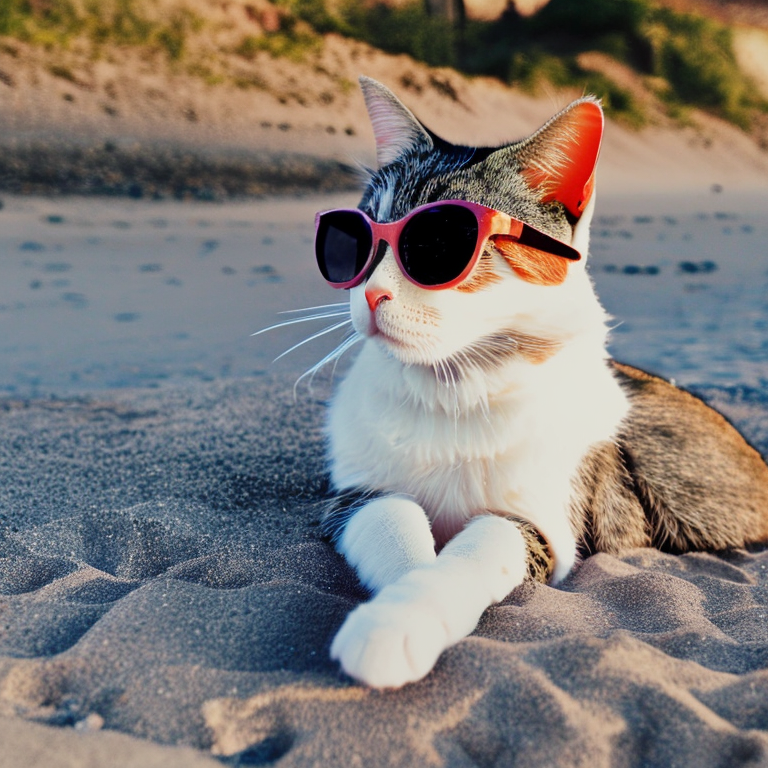
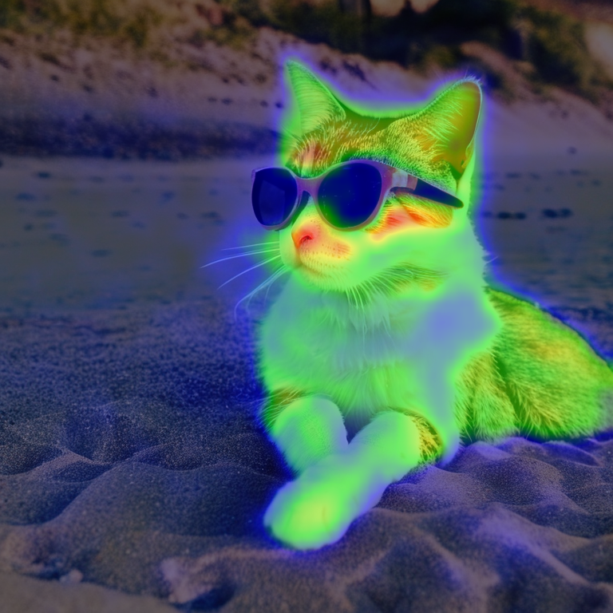
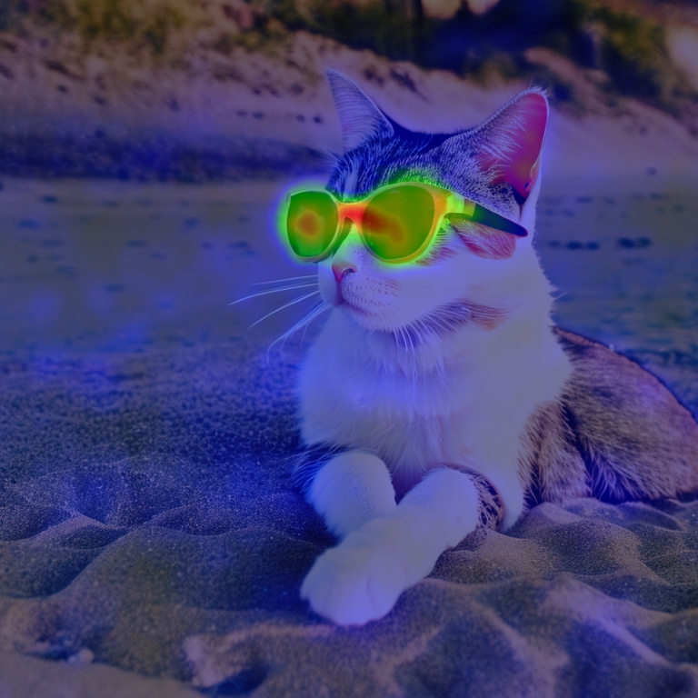
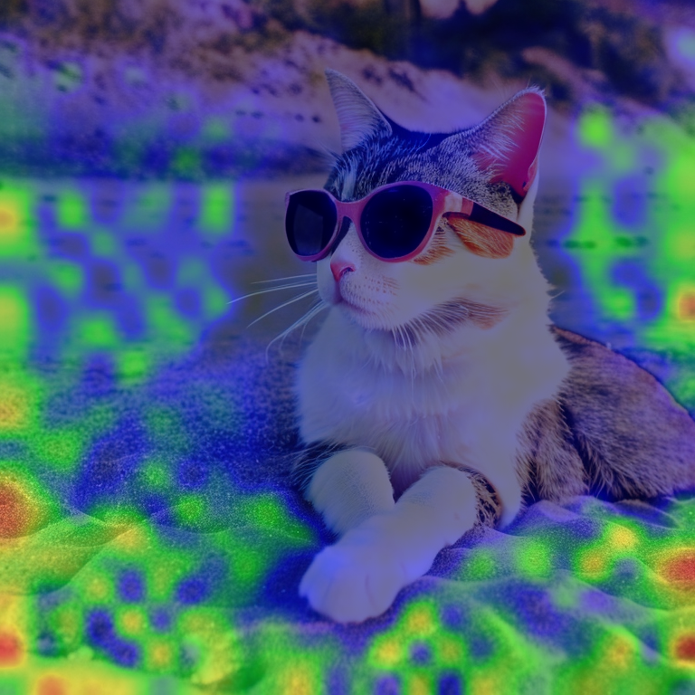

# DAAM Extension for Stable Diffusion Web UI

This is a port of [DAAM](https://github.com/castorini/daam) for Stable Diffusion Web UI.

# Setup and Running

Clone this repository to extension folder.

# How to use

Select "Daam script" from the script drop-down. Enter the 'attention text' (must be a string contained in the prompt ) and run.
An overlapping image with a heatmap for each attention will be generated along with the original image.
Images will now be created in the default output directory.

Attention text is divided by commas, but multiple words without commas are recognized as a single sequence.
If you type "cat" for attention text, then all the tokens matching "cat" will be retrieved and combined into attention.
If you type "cute cat", only tokens with "cute" and "cat" in sequence will be retrieved and only their attention will be output.

# Sample

prompt : "A photo of a cute cat wearing sunglasses relaxing on a beach"

attention text: "cat, sunglasses, beach"

output images: orginal, cat, sunglasses, beach

# Tutorial

- [Easiest way to use DAAM script tutorial](https://www.youtube.com/watch?v=XiKyEKJrTLQ)

# Notice
At the moment, this works well with the Stable Diffusion 1.5 model.
However, in the Stable Diffusion 2.0 model this seems to be working a little less well.

